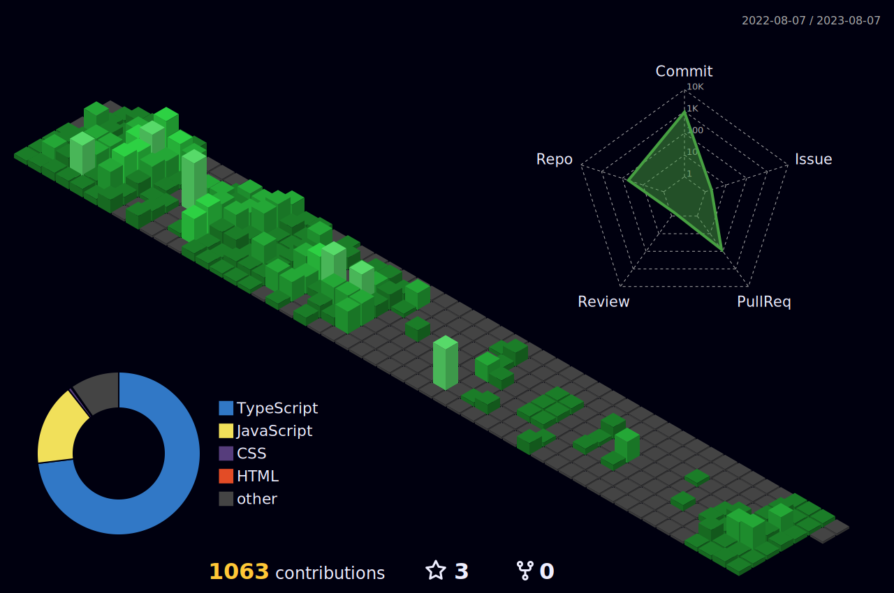

<!-- #  Welcome 👋 -->

<!--  -->

<!-- 
-   안녕하세요. 항상 사고하는 주니어 프론트엔드 개발자 권형석입니다.
-   부트캠프를 수료하며 함께 소통하고 성장하는 즐거움의 가치를 배웠습니다.
-   맡은 일은 반드시 끝내야만 하는 성실함과 꼼꼼함을 지녔습니다. -->
<!-- -   Email address : hskwon517@gmail.com -->
<!-- -   https://velog.io/@hskwon517 -->
<!-- blog >>>>>> 1️⃣https://velog.io/@hskwon517 2️⃣https://hskwon5170.github.io -->

<!-- 
 -->

<!--  -->

<!--## Things I can do -->
### ✔ Skills

  <!-- First row -->
  
  
  
  
  
   
  <!-- Second row -->
  
 
  
 
  
 
 
 
  
   
 
  
 
 
  
 
 
   
   
 
  
  
   

### 📚 Currently Studying & Interested In

  
  
  

<!--  -->

 <!--     
    ![Recoil](https://img.shields.io/badge/Recoil-007af4.svg??style=flat-square&logo=data:image/svg+xml;base64,PHN2ZyBpZD0iQ2FscXVlXzEiIGRhdGEtbmFtZT0iQ2FscXVlIDEiIHhtbG5zPSJodHRwOi8vd3d3LnczLm9yZy8yMDAwL3N2ZyIgdmlld0JveD0iMCAwIDI1NS4yMSA2MjMuOTEiPjxkZWZzPjxzdHlsZT4uY2xzLTF7ZmlsbDp3aGl0ZX08L3N0eWxlPjwvZGVmcz48cGF0aCBjbGFzcz0iY2xzLTEiIGQ9Im03NC42MiAyNzcuNDYgMS4yNC0uMTMgMzQuNzgtMy4yOC01My40Ny01OC42NkE5Ni40NyA5Ni40NyAwIDAgMSAzMiAxNTAuM0gzYTEyNS4zIDEyNS4zIDAgMCAwIDMyLjggODQuNTdaTTE3Ny4xMyAzNDdsLTM2IDMuNCA1My4zMiA1OC41MUE5Ni40MSA5Ni40MSAwIDAgMSAyMTkuNjMgNDc0aDI4LjkyYTEyNS4yOCAxMjUuMjggMCAwIDAtMzIuNzYtODQuNTdaIi8+PHBhdGggY2xhc3M9ImNscy0xIiBkPSJNMjUzLjY5IDIzMS42OGMtNi4zMy0zMS4zLTMwLjg5LTU0LjA5LTYyLjU3LTU4LjA3bC02LjM1LS43OWE0OS42MSA0OS42MSAwIDAgMS00My4zNS00OS4xM3YtMjBhNTIuNzUgNTIuNzUgMCAxIDAtMjguOTEtLjM2djIwLjM4YTc4LjU2IDc4LjU2IDAgMCAwIDY4LjY1IDc3LjgybDYuMzYuOGMyMy4yNCAyLjkyIDM0Ljc4IDIwIDM3LjgzIDM1LjFzLS45MyAzNS4zMi0yMS4yMiA0N2E3My44MSA3My44MSAwIDAgMS0zMC4wNiA5LjYybC05NS42NiA5YTEwMi40NSAxMDIuNDUgMCAwIDAtNDEuOCAxMy4zOEM5IDMzMi40NS00LjgxIDM2MyAxLjUyIDM5NC4yOXMzMC44OSA1NC4wOCA2Mi41NyA1OC4wNmw2LjM1LjhhNDkuNiA0OS42IDAgMCAxIDQzLjM1IDQ5LjEydjE4YTUyLjc1IDUyLjc1IDAgMSAwIDI4LjkxLjI2di0xOC4yNmE3OC41NSA3OC41NSAwIDAgMC02OC42NS03Ny44MWwtNi4zNi0uOGMtMjMuMjQtMi45Mi0zNC43OC0yMC4wNS0zNy44My0zNS4xMXMuOTMtMzUuMzIgMjEuMjItNDdhNzMuNjggNzMuNjggMCAwIDEgMzAuMDYtOS42M2w5NS42Ni05YTEwMi40NSAxMDIuNDUgMCAwIDAgNDEuOC0xMy4zOGMyNy42NS0xNi4wMiA0MS40LTQ2LjU0IDM1LjA5LTc3Ljg2WiIvPjwvc3ZnPg==&logoColor=white)   
        
  
      
   
### 📚 Currently Studying & Interested In

-007ACC?style=flat-square&logo=data:image/svg+xml;base64,PHN2ZyB4bWxucz0iaHR0cDovL3d3dy53My5vcmcvMjAwMC9zdmciIHZpZXdCb3g9IjAgMCAyNCAyNCI+PHBhdGggZmlsbD0id2hpdGUiIGQ9Ik0xMiAybDkuOCA1djEwbC05LjggNS05LjgtNVY3TDEyIDJ6Ii8+PC9zdmc+&logoColor=white)
 

 
 

